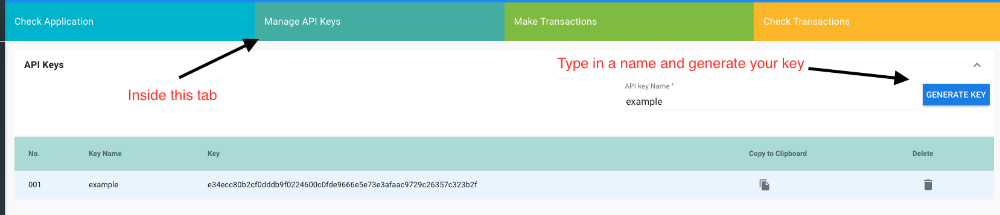

   
******************
SIMBA CarDemo Android Docs
******************
 
Installation
==============

* Hit the "Clone or Download" button in upper right corner of the github page
* Hit the "Download ZIP" button.
* "Extract the file" with your extractor of choice.
* Open Android Studio and click "Open an existing Android Studio Project."
* Navigate to where the extracted project is and select the project directory of the project (the one that contains the "app" folder) and hit "OK."
* After a brief install, Android Studio should open the project.
* Dependencies

   * This demo app uses the following:
   * Retrofit, okhttp, and gson for GETs and POSTs
   * Web3j, Kethereum, and bitcoinj for the HDwallets
   * Dexter for making permissions easier to handle at run time.

 .. note:: HDwallets are not setup to be encrypted when stored locally. This should be addressed for any usage apart from demo purposes.
==============

`Here <https://www.youtube.com/watch?v=1BatYaRD60c&list=PLgfX2jfDfJNMEqF_xjZBYmavONXeRK_q5>`_ is a playlist on the SIMBA Chain Youtube channel to get you up to speed on using the dashboard.

.. _contract:
Smart Contract
************

Here is the smart contract I used for Android

.. code-block:: python

   contract Application {
    function Application() public {}

    function carSale (
        string soldTo,
        string amount,
        string _bundleHash
    )
    public {}

    function registerCar (
        string VIN,
        string Make,
        string Model,
        string _bundleHash
    )
    public {}

    function accidentReport (
        string report_name,
        string _bundleHash
    )
    public {}
    }

.. _dashboard:
Creating an app on the SIMBA Dashboard
***************
Before Starting make sure you have an account on the Simba Dashboard and an Ethereum wallet with Ether in it on the Rinkeby testnet

* Create The Smart Contract
* Create The Application
* Configure The Application(Ethereum Blockchain, Rinkeby Network,IPFS Filesystem, Permission disabled)
* Generate API Key(This is not the API name)

Converting the Cardemo example to your app
***************
Steps to convert Android cardemo to your own version of the cardemo
   *Updating the URL
      *In ApiClientBuilder.java ~Line 16
      *In GetActivity.kt ~Line 37 and ~Line 87
      *In DetailActivity.kt ~Line 63
      *In PostActivity.kt ~Line 196 and ~Line 298
       .. note:: The only part of the URL you need to change is "ioscardemo2" with whatever you chose for your app's API name(not the name of your apikey)
   *Updating API Key
      *In Methods.kt ~Line 20, ~Line 2, ~Line 30, ~Line 35, and ~Line 41
      *In ApiClient.java ~Line 19
      
      
  
